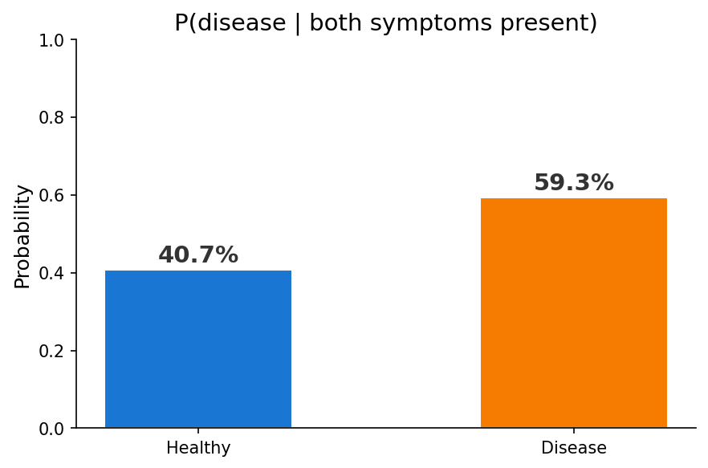
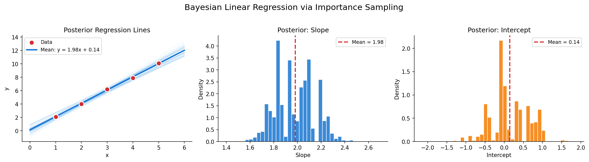
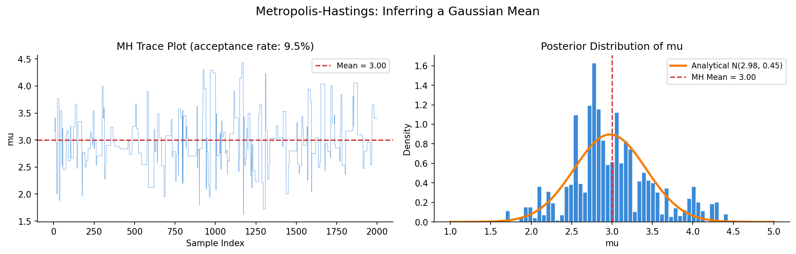
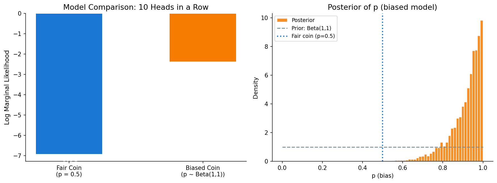
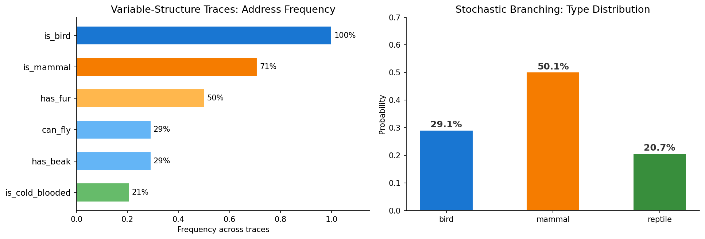

# Cathedral

<p align="center">
  
</p>

[](https://github.com/andrewgiessel/cathedral/actions/workflows/python-package.yml)

A Pythonic probabilistic programming library inspired by [Church](https://cocolab.stanford.edu/papers/GoodmanEtAl2008-UncertaintyInArtificialIntelligence.pdf) and [WebPPL](http://webppl.org/). Write probabilistic models as plain Python functions, then run inference to get posteriors.

Cathedral fills a gap in the Python ecosystem: **Church/WebPPL-level expressiveness** (stochastic control flow, recursive models, stochastic memoization) with **Pythonic syntax** and access to Python's scientific computing stack.

## Quick Start

```python
from cathedral import model, infer, flip

@model
def sprinkler():
    rain = flip(0.3)
    sprinkler_on = flip(0.5)
    if rain:
        wet = flip(0.9)
    elif sprinkler_on:
        wet = flip(0.8)
    else:
        wet = flip(0.1)
    return {"rain": rain, "sprinkler": sprinkler_on, "wet": wet}

# One model, many queries — pass the condition externally (Church-style)
posterior = infer(sprinkler, method="enumerate", condition=lambda r: r["wet"])
print(f"P(rain | wet grass) = {posterior.probability('rain'):.4f}")
# P(rain | wet grass) = 0.4615

posterior = infer(sprinkler, method="enumerate",
                 condition=lambda r: r["wet"] and r["sprinkler"])
print(f"P(rain | wet, sprinkler on) = {posterior.probability('rain'):.4f}")
# P(rain | wet, sprinkler on) = 0.3253  (explaining away!)
```

## Installation

```bash
pip install cathedral

# With visualization extras (matplotlib, graphviz, arviz)
pip install cathedral[viz]
```

Requires Python >= 3.10, numpy, and scipy.

## Bayesian Inference in Action

### Medical Diagnosis

A disease has 1% base rate, but produces two symptoms with high probability. What happens when a patient presents with both?

```python
@model
def medical_diagnosis():
    disease = flip(0.01)
    if disease:
        symptom_a = flip(0.9)
        symptom_b = flip(0.8)
    else:
        symptom_a = flip(0.05)
        symptom_b = flip(0.1)
    condition(symptom_a and symptom_b)
    return disease

posterior = infer(medical_diagnosis, method="enumerate")
```

<p align="center"></p>

Despite the low base rate, observing both symptoms raises P(disease) to 59% — a classic base-rate neglect problem that exact enumeration gets right.

### Bayesian Linear Regression

```python
@model
def line_model():
    slope = sample(Normal(0, 5), name="slope")
    intercept = sample(Normal(0, 5), name="intercept")
    for x, y in zip(xs, ys):
        observe(Normal(slope * x + intercept, 0.5), y)
    return {"slope": slope, "intercept": intercept}

posterior = infer(line_model, method="importance", num_samples=10000)
```

<p align="center"></p>

### Metropolis-Hastings: Inferring a Gaussian Mean

Five observations near 3.0. MH explores the posterior, and the samples match the analytical solution:

```python
@model
def gaussian_mean():
    mu = sample(Normal(0, 5), name="mu")
    for y in [3.0, 3.5, 2.5, 3.2, 2.8]:
        observe(Normal(mu, 1), y)
    return mu

posterior = infer(gaussian_mean, method="mh", num_samples=2000, burn_in=500)
```

<p align="center"></p>

### Model Comparison

Observed 10 heads in a row. Is the coin fair, or biased? Bayes factors quantify the evidence:

```python
from cathedral.checks import compare_models

p_fair = infer(fair_coin, method="importance", num_samples=10000)
p_biased = infer(biased_coin, method="importance", num_samples=10000)
print(compare_models({"fair_coin": p_fair, "biased_coin": p_biased}))
```

<p align="center"></p>

### Variable-Structure Traces

Unlike PyMC or Stan, Cathedral supports **stochastic control flow** — different executions can have entirely different random variables. The toolkit tracks which addresses appear in which traces:

```python
@model
def animal():
    is_bird = flip(0.3, name="is_bird")
    if is_bird:
        can_fly = flip(0.8, name="can_fly")
        has_beak = flip(0.99, name="has_beak")
        return {"type": "bird", "flies": can_fly}
    else:
        is_mammal = flip(0.7, name="is_mammal")
        if is_mammal:
            has_fur = flip(0.95, name="has_fur")
            return {"type": "mammal", "fur": has_fur}
        else:
            is_cold_blooded = flip(0.8, name="is_cold_blooded")
            return {"type": "reptile"}
```

<p align="center"></p>

## Primitives

| Primitive | Description |
|-----------|-------------|
| `flip(p)` | Flip a coin with probability `p` of True |
| `sample(dist)` | Draw from any distribution (`Normal`, `Beta`, `Gamma`, ...) |
| `condition(pred)` | Hard conditioning: reject execution if `pred` is False |
| `observe(dist, val)` | Soft conditioning: score execution by `dist.log_prob(val)` |
| `factor(score)` | Add arbitrary log-probability to the trace |
| `mem(fn)` | Stochastic memoization: same args always return same random result |
| `DPmem(alpha, fn)` | Dirichlet Process memoization for nonparametric models |

## Inference Methods

| Method | Syntax | Best for |
|--------|--------|----------|
| **Rejection sampling** | `infer(m, method="rejection")` | Small discrete models with `condition()` |
| **Importance sampling** | `infer(m, method="importance")` | Continuous models with `observe()` |
| **Single-site MH** | `infer(m, method="mh")` | Complex models, rare conditions, many latent variables |
| **Exact enumeration** | `infer(m, method="enumerate")` | Small discrete models where you want exact answers |

## Distributions

**Continuous:** `Normal`, `HalfNormal`, `Beta`, `Gamma`, `Uniform`

**Discrete:** `Bernoulli`, `Categorical`, `UniformDraw`, `Poisson`, `Geometric`

**Multivariate:** `Dirichlet`

All distributions support `.sample()`, `.log_prob(value)`, and `.prob(value)`. Discrete distributions also support `.support()` for enumeration.

## Posterior Analysis

```python
posterior = infer(my_model, method="rejection", num_samples=5000)

posterior.mean("param")                     # posterior mean
posterior.std("param")                      # posterior std
posterior.probability("flag")               # P(flag = True)
posterior.probability(lambda r: r > 0)      # P(predicate)
posterior.histogram("param")                # empirical distribution
posterior.credible_interval(0.95, "param")  # 95% credible interval
```

## Diagnostics & Model Understanding

Every inference run returns diagnostic metadata automatically:

```python
posterior = infer(sprinkler, method="rejection", num_samples=1000)
print(posterior.diagnostics())
# Posterior: 1000 samples
#   method: rejection
#   attempts: 1694
#   acceptance rate: 0.5903
#   fixed structure: True

posterior.acceptance_rate          # fraction accepted (rejection/MH)
posterior.ess                     # effective sample size (importance/enumerate)
posterior.log_marginal_likelihood  # for model comparison
posterior.has_fixed_structure      # all traces share the same addresses?
```

### Prior Predictive Checks

```python
from cathedral.checks import prior_predictive, condition_acceptance_rate

pp = prior_predictive(sprinkler, num_samples=5000)

# How hard is your inference problem?
rate = condition_acceptance_rate(sprinkler, num_samples=10000)
# "Condition satisfied 58.5% of the time"
```

### Trace Visualization

```python
from cathedral.viz import print_trace, structure_summary, trace_to_dot

posterior = infer(my_model, method="rejection", capture_scopes=True)
print_trace(posterior.traces[0])
# Trace (result=..., log_joint=-2.3026, 3 choices)
# └── [sprinkler]
#     ├── rain = False  (-1.2040)
#     ├── sprinkler = True  (-0.6931)
#     └── wet = True  (-0.2231)

print(structure_summary(posterior))

dot = trace_to_dot(posterior.traces[0])  # Graphviz DOT output
```

### Diagnostic Plots (requires `cathedral[viz]`)

```python
from cathedral.plots import plot_posterior, plot_weights, plot_trace_values, plot_ess

plot_posterior(posterior, key="rain")
plot_weights(posterior)          # importance weight distribution
plot_trace_values(posterior, "mu")  # MH mixing diagnostic
plot_ess(posterior)              # ESS per address
```

### ArviZ Integration (requires `cathedral[viz]`)

```python
idata = posterior.to_arviz()
# → arviz.InferenceData with posterior group, ready for az.plot_trace(), etc.
```

## Examples

The `examples/` directory contains runnable demonstrations inspired by [Probabilistic Models of Cognition](http://probmods.org/):

| File | Topics |
|------|--------|
| `01_generative_models.py` | Coin flips, composition, `mem`, stochastic recursion, causal models |
| `02_conditioning.py` | Bayesian reasoning, causal vs diagnostic inference, explaining away |
| `03_patterns_of_inference.py` | Bayesian updating, Monty Hall, Occam's razor |
| `04_bayesian_data_analysis.py` | Parameter estimation, model comparison, linear regression |
| `05_mixture_models.py` | Gaussian mixtures, `DPmem` for infinite components |
| `06_social_cognition.py` | Goal inference, preference learning, theory of mind |
| `07_grammars_and_recursion.py` | PCFGs, random arithmetic, conditioned generation |

Plus standalone examples: `sprinkler.py`, `coin_flip.py`, `linear_regression.py`.

## Architecture

Models are plain Python functions. A trace-based execution engine (via `contextvars`) records every random choice without passing trace objects through user code. Inference engines run models repeatedly, using interventions to replay or modify choices.

```
User code           Trace engine           Inference
─────────           ────────────           ─────────
@model fn    →    TraceContext      →    rejection / importance
flip/sample  →    Choice records    →    MH (propose + accept)
condition    →    log_score         →    enumeration (worklist)
observe      →    log_score         →    Posterior + diagnostics
```

## References

- [Church: A Language for Generative Models](https://arxiv.org/pdf/1206.3255v2.pdf) -- Goodman, Mansinghka, Roy, Bonawitz, Tenenbaum
- [Lightweight Implementations of Probabilistic Programming Languages](http://web.stanford.edu/~ngoodman/papers/lightweight-mcmc-aistats2011.pdf) -- Wingate, Stuhlmuller, Goodman
- [Probabilistic Models of Cognition](http://probmods.org/) -- Goodman & Tenenbaum
- [WebPPL](http://webppl.org/) -- Goodman & Stuhlmuller
- [Gen.jl](https://www.gen.dev/) -- Cusumano-Towner, Saad, Lew, Mansinghka
- [From Word Models to World Models](https://arxiv.org/abs/2306.12672) -- Wong, Grand, Lew, Goodman et al.

## License

MIT -- see [LICENSE](LICENSE).
