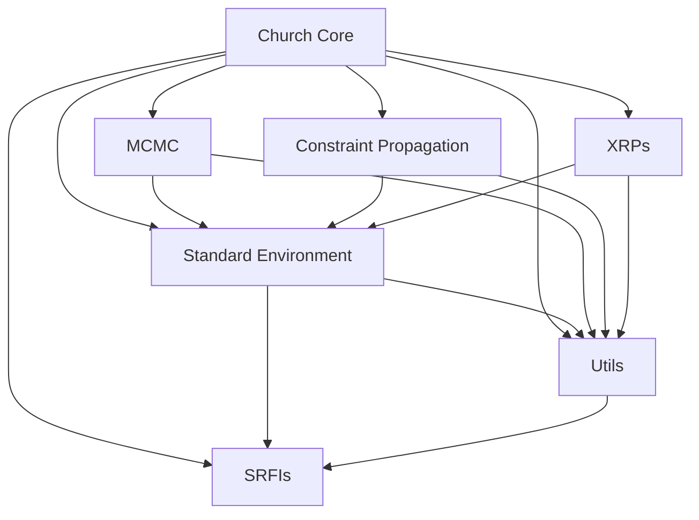

# MIT Church Dependency Documentation

This folder contains markdown files documenting the internal dependencies of the MIT Church codebase, as discovered during the porting effort to Hy (https://hylang.org/).

Each file describes a major subsystem or dependency cluster, making it easier to reason about and port the code incrementally. Use these docs as a reference for understanding how modules interact and for planning the porting process.

- Each markdown file covers a major dependency group (e.g., core, standard environment, utils, MCMC, constraint propagation, XRPs, SRFI, etc.).
- Update these docs as you learn more or as the codebase evolves.

---

**Generated as part of the MIT Church → Hy porting project.**

---

## Dependency Diagram

This diagram shows the high-level relationships between the major subsystems. For more detail, see the individual markdown files in this folder.
